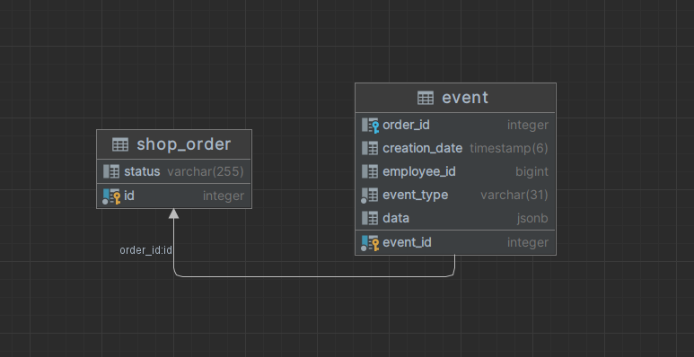

# Сервис заказов в кофейне

# Оглавление
1. [📌 Описание](#описание)
2. [🔍 Особенности](#особенности)
3. [Реализация Event Sourcing](#реализация-event-sourcing)
4. [Схема базы данных](#схема-базы-данных)
5. [🚀 Запуск и Сборка Проекта](#запуск-и-сборка-проекта)
   - [Предварительные требования](#предварительные-требования)
   - [🛠 Сборка и конфигурация проекта](#сборка-и-конфигурация-проекта)
   - [Запуск проекта](#запуск-проекта)
   - [Настройки по умолчанию](#настройки-по-умолчанию)
6. [🔑 Использование API](#использование-api)
   - [Публикация события](#публикация-события)
   - [Получение информации о заказе](#получение-информации-о-заказе)
7. [🛠️ Стек технологий](#стек-технологий)

<a name="описание"></a>
## 📌 Описание
Этот проект представляет собой CRM систему для кофейни, которая отслеживает жизненный цикл заказа от момента его регистрации до выдачи клиенту.
Основываясь на концепции Event Sourcing, каждый этап заказа представлен в виде отдельного события.

<a name="особенности"></a>
## 🔍 Особенности

- **Event Sourcing**:
- Вместо традиционного представления заказа в виде одной записи в базе данных, система использует цепочку событий.
- Это обеспечивает гибкость в учете и анализе заказов.

- **Реляционная БД**:
- Все данные хранятся в реляционной базе данных PostgreSQL.

- **Проверка Условий**:
- Система гарантирует, что каждое событие соответствует определенным бизнес-правилам, а именно:
  - Любому из событий должно предшествовать событие регистрации заказа
  - Если заказ уже выдан или отменен, то публикация новых событий недоступна
- **Система реализует следующий интерфейс**:
```java
interface OrderService {
   void publishEvent(OrderEvent event);
   Order findOrder(int id);
}
```
Система предоставляет простой и интуитивно понятный интерфейс для публикации событий и получения информации о заказах.

<a name="реализация-event-sourcing"></a>
### Реализация Event Sourcing
- **Неизменяемость событий**:
- В нашей системе, как только событие создано, оно становится неизменяемым.
- Это гарантирует, что история заказа сохраняется в первозданном виде и не может быть изменена или искажена впоследствии.
- Этот подход обеспечивает надежность и прозрачность истории каждого заказа.

- **Агрегация событий**:
- Для оптимизации производительности и удобства работы с заказами, мы используем агрегат Order.
- Этот агрегат хранит последний статус заказа, что позволяет нам быстро получить текущее состояние заказа без необходимости проходить по всему списку событий.
- Это особенно полезно при частых запросах к заказам, так как снижает нагрузку на систему и ускоряет время ответа.

- **Хранения событий**:
- базовые поля события хранятся в своих столбцах
  - event_id
  - order_id
  - employeeId
  - creation_date
  - event_type

- поля дочерних событий хранятся в формате json
  - data

<a name="схема-базы-данных"></a>
## Схема базы данных


<a name="запуск-и-сборка-проекта"></a>
## 🚀 Запуск и Сборка Проекта

<a name="предварительные-требования"></a>
### Предварительные требования

1. Убедитесь, что у вас установлены [Java 17](https://www.oracle.com/java/technologies/javase-jdk17-downloads.html) и [Maven](https://maven.apache.org/download.cgi).
2. Клонируйте репозиторий на ваш локальный компьютер.

<a name="сборка-и-конфигурация-проекта"></a>
### 🛠 Сборка и конфигурация проекта

Для корректной работы приложения, необходимо задать следующие параметры окружения:
- `PROD_DB_HOST`: Хост базы данных.
- `PROD_DB_PORT`: Порт базы данных.
- `PROD_DB_NAME`: Название базы данных.
- `PROD_DB_USERNAME`: Имя пользователя базы данных.
- `PROD_DB_PASSWORD`: Пароль пользователя базы данных.
### Пример
Для сборки проекта выполните следующие шаги:
1. Откройте терминал.
2. Перейдите в корень директории проекта.
3. Выполните команду:
```bash
./mvnw clean install
```

<a name="запуск-проекта"></a>
### Запуск проекта

### Нужно задать переменные среды при старте сервиса
```bash
export PROD_DB_HOST=localhost
export PROD_DB_PORT=5432
export PROD_DB_NAME=postgres
export PROD_DB_USERNAME=postgres
export PROD_DB_PASSWORD=postgres
```
```bash
./mvnw spring-boot:run
```
### Или запустить с переменными:
```bash
./mvnw spring-boot:run \
-Ddb.host=${PROD_DB_HOST} \
-Ddb.port=${PROD_DB_PORT} \
-Ddb.name=${PROD_DB_NAME} \
-Ddb.username=${PROD_DB_USERNAME} \
-Ddb.password=${PROD_DB_PASSWORD}
```
### Можно указать файл конфигурации вместо переменных
```bash
./mvnw spring-boot:run \
-D"spring-boot.run.profiles"={profile_name} \
-D"spring.config.location"=file:/path/config/
```
<a name="настройки-по-умолчанию"></a>
### Настройки по умолчанию
1. Порт по умолчанию 8080
2. Схема базы данных создается автоматически (ddl-auto: create)

<a name="использование-api"></a>
# 🔑 Использование API

<a name="публикация-события"></a>
## Публикация события
Вы можете публиковать события, связанные с заказами, отправляя POST-запрос на следующий URL:
- http://localhost:8080/orders/events

### Публикация события REGISTERED
```json
{
  "event_type": "REGISTERED",
  "client_id": 123,
  "employee_id": 456,
  "expected_pickup_time": "12:30",
  "product_id": 789,
  "product_cost": 99.99
}
```
### Публикация события STARTED
```json
{
"event_type": "STARTED",
"employee_id": 456,
"order_id": 1
}
```
### Публикация события COMPLETED
```json
  {
  "event_type": "COMPLETED",
  "employee_id": 456,
  "order_id": 1
}
```
### Публикация события DELIVERED
```json
  {
  "event_type": "DELIVERED",
  "employee_id": 456,
  "order_id": 1
}
```
### Публикация события CANCELLED
```json
  {
  "event_type": "CANCELLED",
  "order_id": 1,
  "employee_id": 456,
  "cancel_reason": "кофе закончился"
}
```

<a name="получение-информации-о-заказе"></a>
## Получение информации о заказе
Для получения информации о заказе, отправьте GET-запрос на следующий URL, указав ID заказа в пути:
- http://localhost:8080/orders/{orderId}
  Пример ответа:
```json
{
  "order_id": 1,
  "status": "REGISTERED",
  "events": [
    {
      "event_type": "REGISTERED",
      "event_id": 1,
      "creation_date": "2023-09-25T17:26:54",
      "employee_id": 456,
      "client_id": 123,
      "expected_pickup_time": "12:30",
      "product_id": 789,
      "product_cost": 99.99
    }
  ]
}
```

<a name="стек-технологий"></a>
## 🛠️ Стек технологий:

- Java 17
- Spring Framework (JPA / web)
- PostgreSQL
- Maven
- Lombok
- Swagger